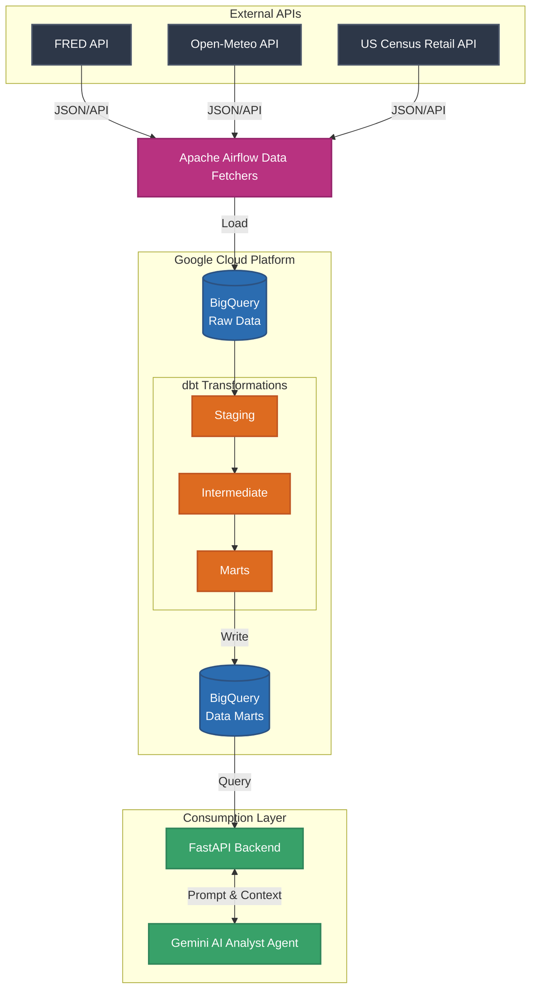

# Macroeconomic & Climate Analytics Platform

An end-to-end data analytics project designed to extract actionable insights from macroeconomic indicators, consumer retail behavior, and climate data. 

This platform automatically ingests, models, and analyzes time-series data to explore the intersection of environmental factors, economic performance, and consumer spending. By transforming raw API feeds into structured BigQuery data marts using `dbt`, the project enables advanced SQL analysis, business intelligence workflows, and natural language querying via a built-in AI Analyst Agent.

While powered by data engineering infrastructure (Apache Airflow, dbt, PostgreSQL), the core focus is on data modeling, anomaly detection, and delivering immediate analytical insights.

---

## Business & Analytical Capabilities

- **AI-Powered Business Intelligence**: Integrates a Gemini-powered AI agent to interrogate BigQuery data marts and generate executive summaries using natural language.
- **Dimensional Data Modeling**: Uses `dbt` to transform raw observations into clean, analytics-ready fact and dimension tables.
- **Climate, Economic & Consumer Correlation**: Evaluates relationships between inflation, employment rates, consumer retail spending, and extreme weather events (e.g., dry spells, extreme temperature anomalies).
- **Advanced Time-Series Analysis**: Handles complex SQL aggregations including 30-day rolling averages, year-over-year percentage changes, and gaps-and-islands problems.
- **Automated Data Pipelines**: Uses Apache Airflow to reliably orchestrate daily data ingestion from the FRED, Open-Meteo, and US Census APIs into cloud data warehouses.
- **Cloud Analytics**: Natively built on Google BigQuery for highly performant, scalable querying.

---

## Analytical Queries & SQL Logic

The core value of this project lies in the analytical questions it answers. The `sql/` directory contains complex SQL logic designed to uncover specific trends:

**Economic & Environmental Trends**
- **Year-over-Year Percentage Change**: Calculates YoY inflation and unemployment shifts.
- **30-Day Rolling Averages**: Smooths volatile daily temperature metrics to identify macro trends.
- **Extreme Event Tracking**: Identifies the hottest/rainiest years and calculates average yearly differences.

**Advanced SQL Techniques**
- **Longest Dry Spell / Subzero Streak**: Uses window functions and gaps-and-islands logic (via `dbt` macros) to calculate consecutive days of extreme weather conditions.
- **Historical Benchmarking**: Compares metrics before and after the year 2000 to analyze long-term baseline shifts.

---

## dbt Transformations & Data Modeling

The dbt project organizes transformations into a strict, three-tier dimensional modeling structure:

1. **Staging (`models/staging/`)**: Cleans raw BigQuery tables and standardizes schemas (`stg_weather_observations`, `stg_economic_observations`, `stg_retail_observations`). Includes strict schema validation and custom bounds tests to ensure data quality.
2. **Intermediate (`models/intermediate/`)**: Handles heavy time-series aggregations and pivoting:
   - `int_monthly_weather_aggregates`: Calculates monthly average temperatures, total rainfall, and freeze days.
   - `int_dry_spell`: Solves gaps-and-islands problems dynamically.
   - `int_economic_indicators_pivoted` & `int_retail_pivoted`: Pivots long-format FRED and Census series into structured wide columns.
3. **Marts (`models/marts/`)**: The final presentation layer.
   - `fct_monthly_macro_weather`: Joins monthly climate metrics with macroeconomic indicators.
   - `fct_monthly_retail_macro`: Blends monthly retail sales data with economic indicators to analyze consumer behavior against inflation and employment trends.

---

## Tools & Technologies

- **Data Warehousing**: Google BigQuery, Snowflake, PostgreSQL
- **Data Transformation**: dbt (data build tool) & dbt-bigquery
- **Orchestration**: Apache Airflow
- **AI & Analytics**: Google Gemini API (google-genai), Pandas
- **APIs & Ingestion**: Python, FastAPI, AWS S3
- **CI/CD**: GitHub Actions (automated dbt testing)

---

## Architecture Pipeline



---

## Getting Started

**1. Clone the repository**
```bash
git clone https://github.com/AaronVillegas5/macro-data-pipeline.git
cd macro-data-pipeline
```

**2. Environment Variables**
Copy `.env.example` to `.env` and fill in your credentials:
```env
FRED_API_KEY=your_fred_api_key
DATABASE_URL=postgresql://user:password@db:5432/db
SNOWFLAKE_ACCOUNT=your_snowflake_account
AWS_ACCESS_KEY_ID=your_aws_key
AWS_SECRET_ACCESS_KEY=your_aws_secret
BIGQUERY_PROJECT_ID=your_gcp_project_id
GEMINI_API_KEY=your_gemini_api_key
```

For BigQuery, authenticate via Application Default Credentials and ensure your `gcp-key.json` is in the project root.

**3. Run the Infrastructure**
Use Docker Compose to start the local database, Apache Airflow orchestrator, and the FastAPI application.
```bash
docker-compose up -d
```

**4. Run dbt Analytics Pipeline**
```bash
dbt run
dbt docs generate
dbt docs serve
```

---

## Future Work

- Build Jupyter-based analysis notebooks for exploratory data analysis.
- Perform strict statistical correlation and lag analysis (e.g., CPI vs retail spending).
- Add forecasting models (ARIMA / XGBoost).
- Deploy an interactive BI dashboard (Streamlit / Plotly Dash).

---

## Author

Aaron Villegas  
University of California, Irvine  
Applied & Computational Mathematics (Data Science)